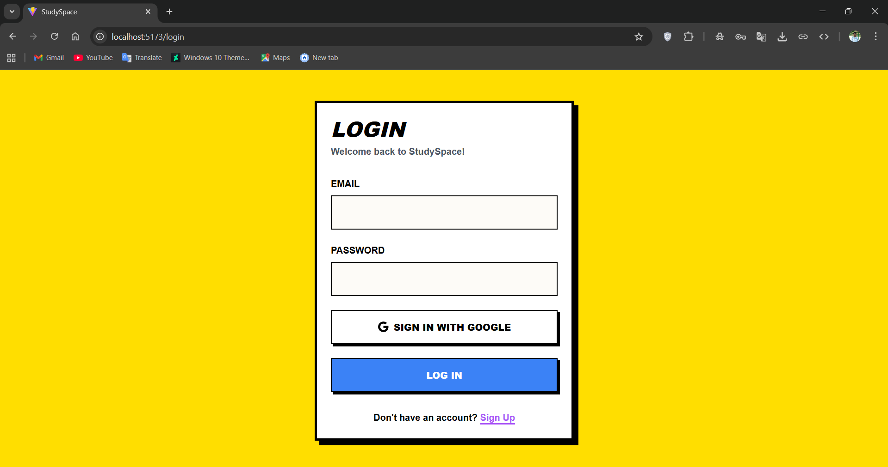
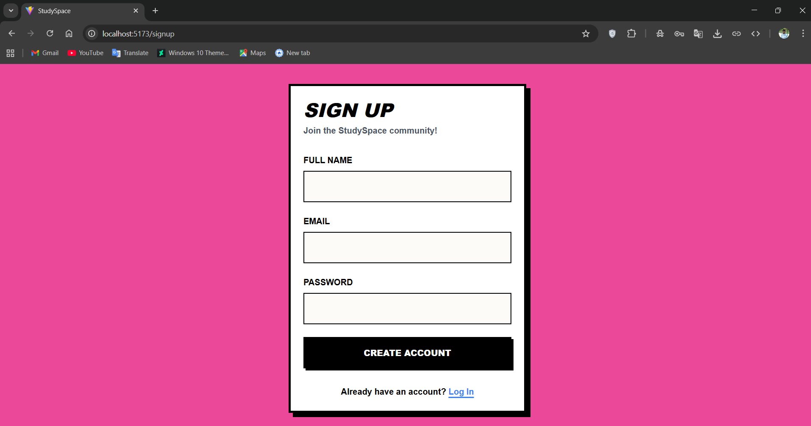
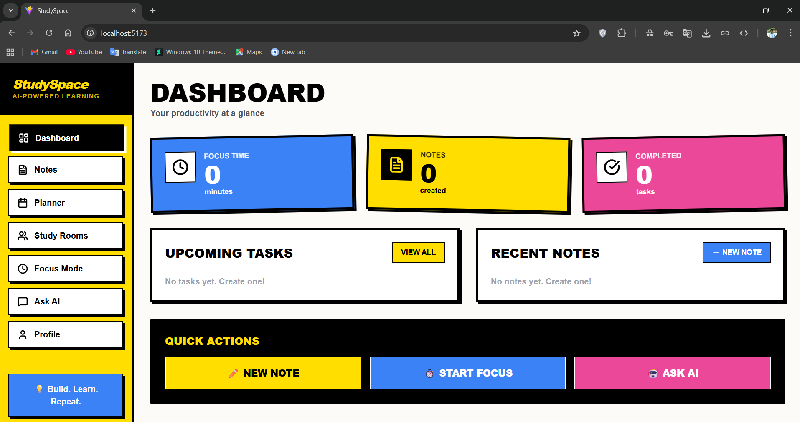
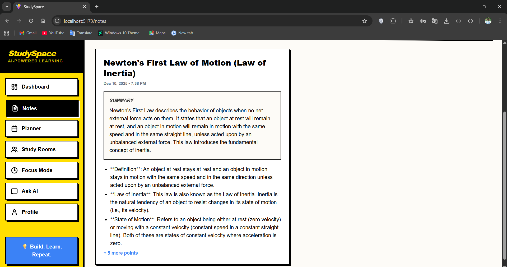
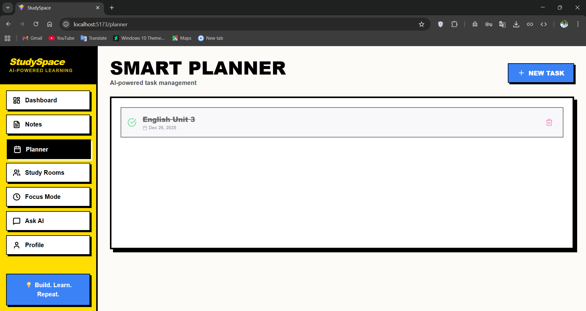
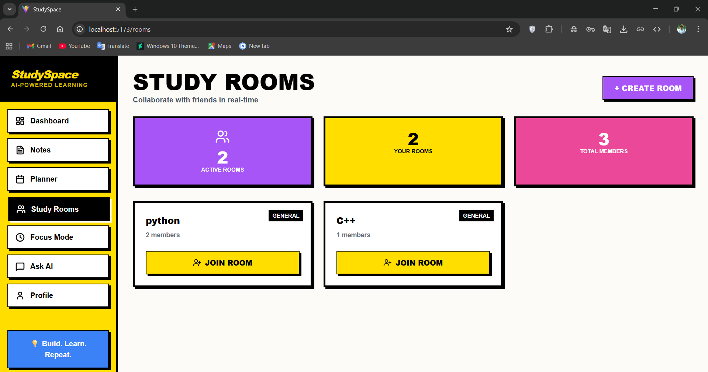
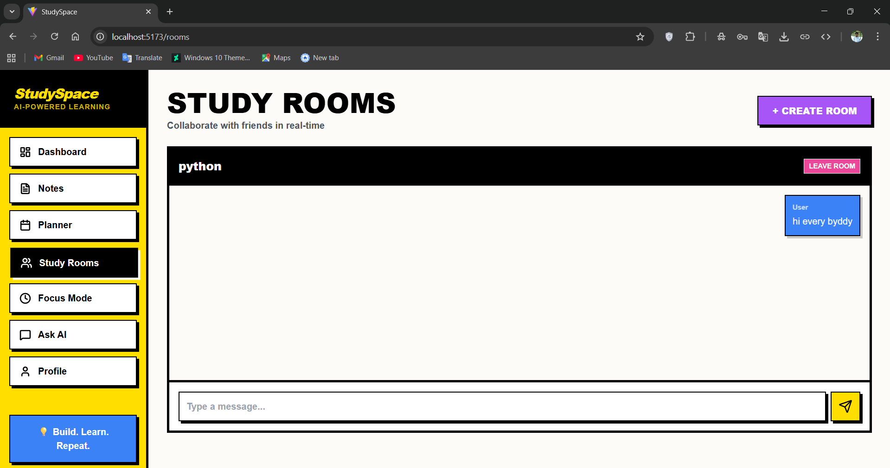
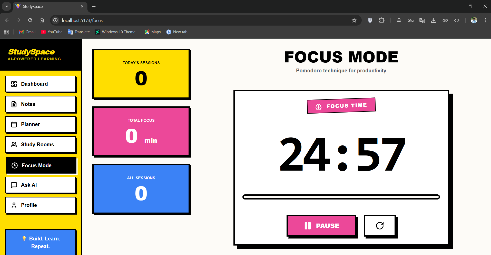
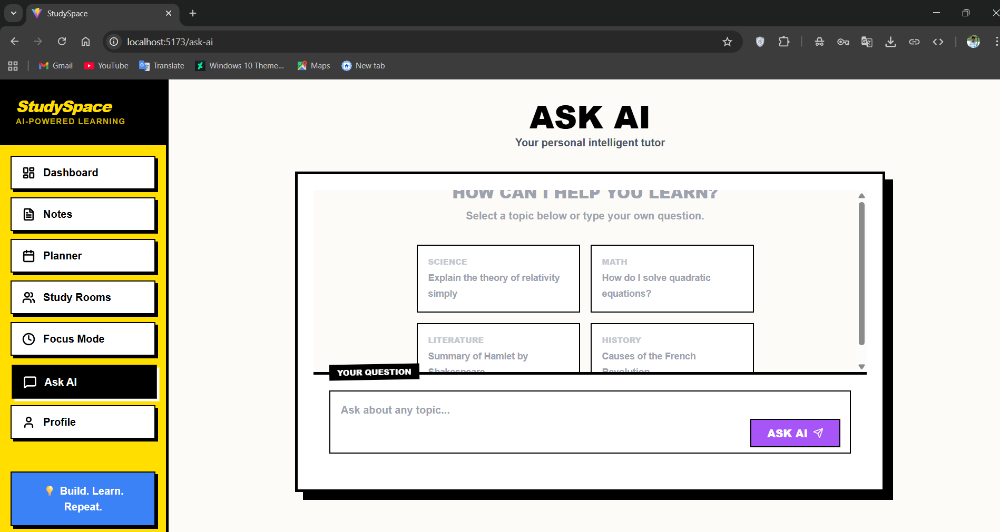
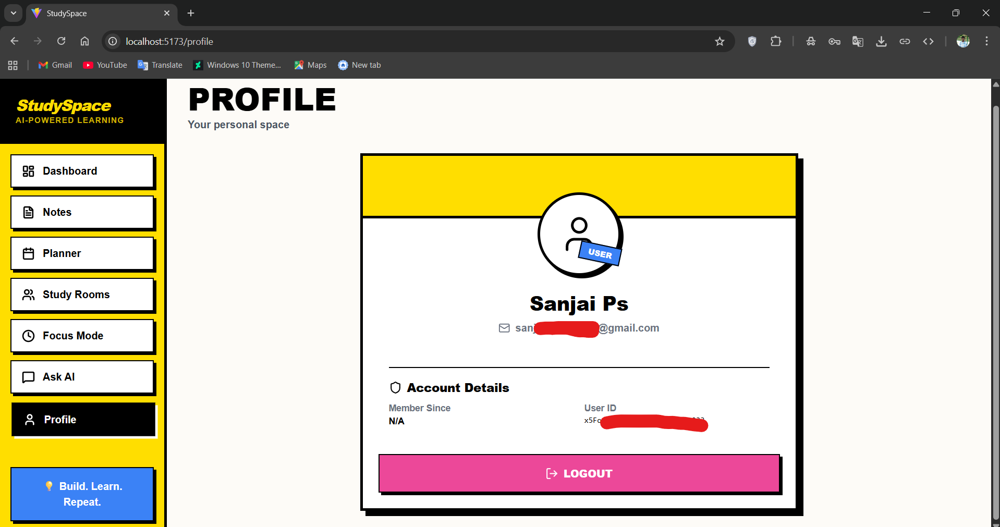

# 🎯 Student Focus (StudySpace)

An AI-powered productivity hub for students to **plan smarter, focus deeper, and study together** — all in one place.

Live Demo: **https://student-focus-eta.vercel.app/**  
Repo: **https://github.com/SanjaiPS-tech/Student-Focus**

---

## 📸 Screenshots

### 🔐 Login & Signup



### 🏠 Dashboard


### 🧠 AI Notes



### ✅ Smart Planner


### 👥 Study Rooms



### ⏱️ Focus Mode


### 💬 Ask AI


### 🙋 Profile



## ✨ Features

### 🔐 Authentication & Layout
- Email-based signup & login using Firebase Authentication.
- Persistent sessions with a global `AuthContext`.
- Protected routes for all app pages.
- Consistent neobrutalist UI with sidebar navigation and top-level layout.

### 📊 Dashboard – Your Study Snapshot
- Personalized overview of your study activity:
  - Total **focus time** (minutes) from saved focus sessions.
  - Total **AI notes** created.
  - Placeholder for **completed tasks** (planner integration ready).
- Shows **recent notes** with quick links.
- Designed as the home base after login.

### 🧠 AI Notes – Smart Study Summaries
- Use **natural language search** to ask questions or paste content.
- Backed by **Google Gemini** (`@google/generative-ai`) to:
  - Generate a structured study note: title, summary, and bullet points.
  - Store notes in **Firestore** under your account.
- View all your AI notes:
  - Human-readable formatted summary.
  - Created date & time.
  - First few bullet points with “+ N more points” indicator.
- Delete notes with a single click.

### ✅ Smart Planner – Simple Task Management
- Create tasks with:
  - **Title**
  - **Due date**
- Tasks are:
  - Stored in Firestore per user.
  - Auto-sorted by due date.
- Update task **status** between `pending` and `completed`.
- Delete tasks when done.
- Clean “no tasks yet” empty state to guide first use.

### 👥 Study Rooms – Real-time Collaboration
- Create **study rooms** with a name (e.g., “DBMS Revision”, “Math Squad”).
- Real-time room list with:
  - Total rooms
  - Rooms you’re in
  - Total members across rooms
- Join rooms and chat live:
  - Messages stored in Firestore subcollections.
  - Shows sender name and text.
- Designed for group study, Q&A, and quick coordination.

### ⏱️ Focus Mode (Backed by Focus Sessions)
- Dedicated page for **distraction-free focus time**.
- Focus sessions are stored in a `focusSessions` collection.
- Dashboard aggregates these sessions into total **focus minutes**.

### 💬 Ask AI (Study Assistant)
- Separate page to talk to an AI assistant (powered by Gemini service).
- Ideal for:
  - Understanding difficult concepts.
  - Getting quick explanations.
  - Brainstorming study strategies.

### 🙋 Profile (User-centric)
- Profile page wired to `AuthContext` user data.
- Groundwork for:
  - Updating display name.
  - Viewing account-level metrics.
  - Customizing the study experience.

---

## 🛠️ Tech Stack

- **Frontend**
  - React (Vite)
  - React Router DOM
  - Tailwind CSS + custom neobrutalist theme
  - Lucide React icons
  - React Markdown (for rich AI content)

- **Backend & Services**
  - Firebase:
    - Authentication
    - Firestore (Notes, Tasks, Focus Sessions, Study Rooms, Messages)
  - Google Gemini (`@google/generative-ai`) for:
    - AI Notes generation
    - Study assistant (Ask AI)

- **Utilities**
  - `date-fns` for date/time formatting
  - `clsx` and `tailwind-merge` for class handling
  - `uuid` for unique IDs where needed

---

## 📂 Project Structure (High Level)

```bash
src/
├─ pages/
│  ├─ Login.jsx
│  ├─ Signup.jsx
│  ├─ Dashboard.jsx
│  ├─ Notes.jsx
│  ├─ Planner.jsx
│  ├─ StudyRooms.jsx
│  ├─ FocusMode.jsx
│  ├─ AskAI.jsx
│  └─ Profile.jsx
├─ components/
│  ├─ Layout.jsx
│  ├─ Card.jsx
│  └─ (shared UI components)
├─ context/
│  └─ AuthContext.jsx
├─ services/
│  ├─ firebase.js
│  └─ gemini.js
├─ App.jsx
└─ main.jsx


🚀 Getting Started
1️⃣ Prerequisites

Node.js (LTS recommended)

npm or pnpm or yarn

A Firebase project (Web app)

A Google AI Studio / Gemini API key

2️⃣ Clone the Repo
git clone https://github.com/SanjaiPS-tech/Student-Focus.git
cd Student-Focus

3️⃣ Install Dependencies
npm install
# or
yarn
# or
pnpm install

4️⃣ Configure Firebase

Create a Firebase project at https://console.firebase.google.com
 and:

Enable Email/Password in Authentication.

Create a Firestore database.

(Optional) Set up any security rules you need.

Then update src/services/firebase.js with your config:

// Example (your keys will be different)
const firebaseConfig = {
  apiKey: "YOUR_FIREBASE_API_KEY",
  authDomain: "YOUR_APP.firebaseapp.com",
  projectId: "YOUR_PROJECT_ID",
  storageBucket: "YOUR_APP.appspot.com",
  messagingSenderId: "YOUR_SENDER_ID",
  appId: "YOUR_APP_ID",
};


Or, if firebase.js reads from environment variables, create a .env file in the project root:

VITE_FIREBASE_API_KEY=your_api_key
VITE_FIREBASE_AUTH_DOMAIN=your_auth_domain
VITE_FIREBASE_PROJECT_ID=your_project_id
VITE_FIREBASE_STORAGE_BUCKET=your_bucket
VITE_FIREBASE_MESSAGING_SENDER_ID=your_sender_id
VITE_FIREBASE_APP_ID=your_app_id

5️⃣ Configure Gemini (Google Generative AI)

Get an API key from: https://ai.google.dev/

Create or update .env:

VITE_GEMINI_API_KEY=your_gemini_api_key


Make sure src/services/gemini.js uses it (example pattern):

import { GoogleGenerativeAI } from "@google/generative-ai";

const genAI = new GoogleGenerativeAI(import.meta.env.VITE_GEMINI_API_KEY);

// export helper functions like generateStudyNotes, askAI, etc.

6️⃣ Run in Development
npm run dev


By default, Vite runs on:
👉 http://localhost:5173

7️⃣ Build for Production
npm run build
npm run preview


For deployment, this project is ready for Vercel (see vercel.json).

🔐 Data Model Overview (Firestore)

Collections used (per user where applicable):

notes

userId

title

content (includes summary, points, etc.)

createdAt

tasks

userId

title

dueDate

status (pending / completed)

createdAt

focusSessions

userId

duration (in seconds)

startedAt / endedAt (depending on implementation)

rooms

name

subject

members (array of user IDs)

createdBy

createdAt

rooms/{roomId}/messages

text

userId

userName

timestamp

📌 Roadmap / Ideas

Richer focus analytics (streaks, daily/weekly charts).

File / resource sharing inside Study Rooms.

Calendar view for the Smart Planner.

Better tag/subject organization for AI Notes.

Dark mode toggle and more customization.

🤝 Contributing

Pull requests and suggestions are welcome!

Fork the repo

Create a new branch: feature/my-feature

Commit your changes

Open a PR

📄 License

This project is currently private/personal.
Add a license (e.g., MIT) here if you decide to open source it.

👨‍💻 Author

Sanjai PS
GitHub: @SanjaiPS-tech
